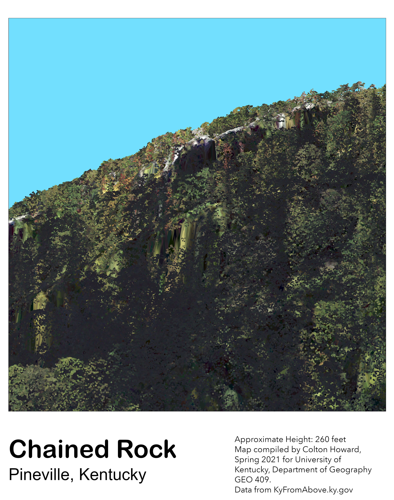
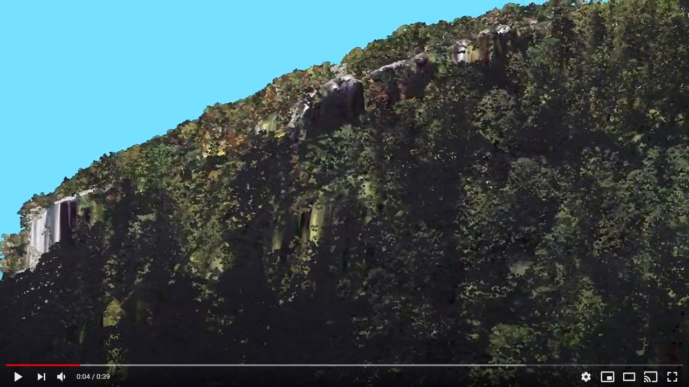

# rrg

Kentucky's Red river Gorge National Geological Area

Download [GeoPDF](rrg-arches.pdf)

## Image of GeoPDF

Web page at: [https://coltonhoward.github.io/rrg/]

### Additional Photos

Photographs of Natural Bridge

   
*photo taken by Bailey,B. (1995).*

   
*Photo taken by Kentucky Tourism, Arts and Heritage Cabinet.*

### Looking Upward at Chained Rock

   
*Chained Rock from a lower elevation view.*

### Animation

   
*Screen capture of animation video*

[Link to Video](https://youtu.be/M3YFM2y4iKQ)

Web page at: [github.com/ColtonHoward/rrg](https://github.com/ColtonHoward/rrg)

### Natural Bridge Site Map

[link to site map](https://api.mapbox.com/styles/v1/ncho225/ckohdr0ka2snx17pgowoeuksc.html?fresh=true&title=copy&access_token=pk.eyJ1IjoibmNobzIyNSIsImEiOiJja2tib3g1d2wwMWt2MnZwaXoyOGx2ZXZiIn0.JUzbwNRH7s0z0fX_Je4sWQ)

### Natural Bridge Tour

[link to tour](https://cesium.com/ion/stories/viewer/?id=3e504b65-0bb4-4eb8-bcb6-4423c66fb050)